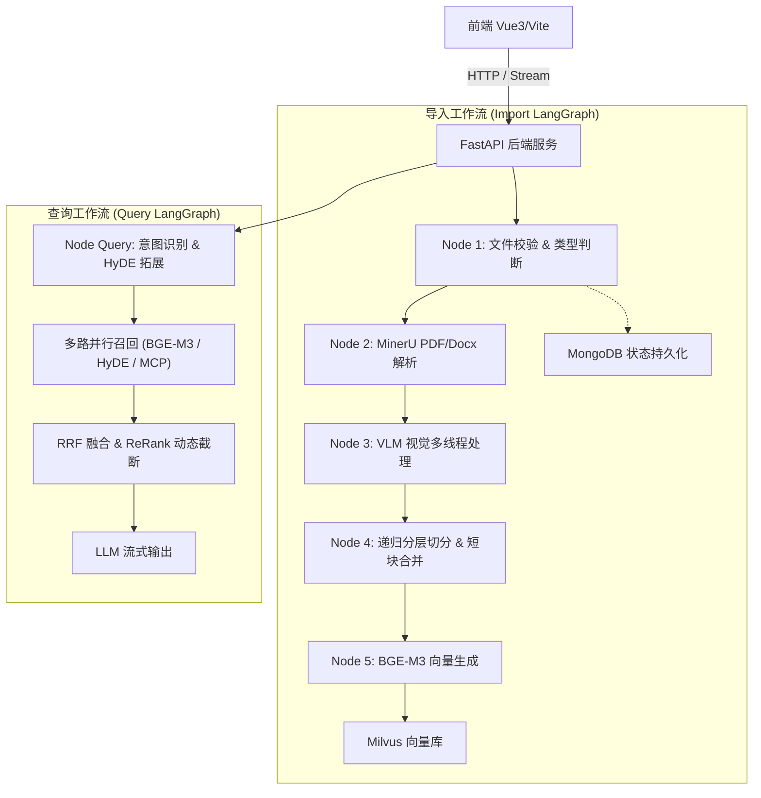

# 🎓 面向学科场景的 RAG 智能问答系统 (rag_agent)

[](https://github.com/dof141/rag_agent)
[](https://www.python.org/)
[](https://fastapi.tiangolo.com/)
[](https://vuejs.org/)
[](https://www.langchain.com/langgraph)
[](https://milvus.io/)

**GitHub 仓库**: [https://github.com/dof141/rag_agent](https://github.com/dof141/rag_agent)

---

## 📌 项目背景

针对日常学习中面对 **PDF 课件、PPT 讲义、Markdown 笔记** 等学习资料碎片化，且通用通用大模型缺乏私有上下文易产生幻觉等问题；本项目搭建了一套面向学科场景的 **RAG 智能问答系统**，实现精准答疑、稳定交互、可工程化落地使用。

---

## 🌟 核心工作与成果

1. **多模态高精解析与分层切分策略**
   - **复杂文档结构提取**：针对复杂排版的 PDF / PPT 文件，采用 **MinerU** 提取 Markdown 结构，调用 **VLM (视觉大模型)** 提取图像语义描述并入库 MinIO；
   - **语义切分优化**：针对纯文本笔记设计**“递归分层切分 + 短块合并”**策略，有效解决长文档 Chunk 切割导致的上下文断裂和语义不完整问题。

2. **多路并行召回与动态重排截断机制**
   - **多路并行召回**：结合稠密/稀疏向量（BGE-M3）、HyDE 假设性回答生成以及 MCP 接口的多路召回机制；
   - **RRF 融合与动态截断**：采用 RRF (Reciprocal Rank Fusion) 算法与 ReRank 重排，对**分差 > 0.5 且降幅大于 25%** 的低相关文档执行动态截断，使**召回精确率达到 90% 以上**，大幅提升回答准确度。

3. **意图识别与多轮上下文改写**
   - 针对大模型答非所问、用户指代不清及连续追问场景，基于大模型进行意图识别并结合 **MongoDB 多轮对话历史**对用户 Query 进行重写与实体提取，**意图分类准确率高达 95%**。

4. **流式交互与服务性能优化**
   - 采用 SSE 打字机流式问答交互，使用 MongoDB 高效存储会话与高频问答信息，有效降低数据库连接压力，显著提升系统响应效率。

5. **工程化落地、Ragas 评测与一键部署**
   - **Ragas 评测体系**：搭建 Ragas 系统，对模型幻觉率、检索召回率及检索精度进行全方位系统评估；
   - **高可用容错兜底**：统一代码与日志规范，配置 API 异常自动重试与全局无过滤兜底检索机制；
   - **Docker 一键部署**：提供容器化 Docker / Docker-Compose 工具，实现全套服务一键快速部署。

---

## 🛠️ 整体技术栈

| 维度 | 技术选型 | 说明 |
| :--- | :--- | :--- |
| **核心 Backend** | Python 3.10+ / FastAPI | 高性能异步接口服务与流式传输 |
| **工作流引擎** | LangGraph / LangChain | 基于状态图的节点拆分与复杂流控 |
| **多模态解析** | MinerU / VLM (Qwen-VL/SenseNova) | PDF/PPT 转 Markdown 及图像语义自动回填 |
| **向量/图存储** | Milvus 2.4+ / Neo4j 5.26+ | BGE-M3 混合向量检索与知识图谱拓展 |
| **状态持久化** | MongoDB 6.0+ | 会话上下文、高频 Q&A 状态持久化与断点自愈 |
| **前端 Frontend** | Vue 3 + TypeScript + Vite | 现代化沉浸式问答与知识库管理 UI |
| **评估与部署** | Ragas / Docker / Docker-Compose | 自动化评测体系与一键容器化部署 |

---

## 🏗️ 系统架构图



---

## 🚀 快速开始与 Docker 一键部署

### 1. 克隆项目
```bash
git clone https://github.com/dof141/rag_agent.git
cd rag_agent
```

### 2. 依赖服务启动 (Docker Compose)
项目根目录提供了 `docker-compose.yml` 配置文件，包含 **Milvus**、**MongoDB**、**Neo4j** 与 **MinIO**：

```bash
docker-compose up -d
```

### 3. 配置 `.env` 环境变量
在项目根目录新建 `.env` 文件：
```ini
# 大模型配置
OPENAI_BASE_URL=http://your-llm-api/v1
OPENAI_API_KEY=your_api_key
LLM_DEFAULT_MODEL=sensenova/deepseek-v4-flash

# VLM 视觉模型配置
VLM_BASE_URL=http://your-vlm-api/v1
VLM_API_KEY=your_vlm_key
VL_MODEL=sensenova/sensenova-6.7-flash-lite

# 数据库配置
MILVUS_URL=http://127.0.0.1:19530
MONGO_URL=mongodb://127.0.0.1:27017
MONGO_DB_NAME=kb002
MINIO_ENDPOINT=127.0.0.1:9000
```

### 4. 启动应用后端与前端

```bash
# 安装 Python 依赖并启动
uv venv
source .venv/bin/activate  # Windows: .venv\Scripts\activate
uv pip install -r requirements.txt

python main.py
```
启动完成后，浏览器访问 `http://127.0.0.1:8000` 即可使用统一问答界面！

---

## 📊 Ragas 自动化评估体系

在 `app/eval/` 目录下引入 **Ragas** 评测指标对 RAG 系统的检索与回答质量进行常态化跑分：

```python
from ragas import evaluate
from ragas.metrics import faithfulness, answer_relevance, context_precision, context_recall

# 运行 Ragas 评测集
score = evaluate(dataset=eval_dataset, metrics=[faithfulness, answer_relevance, context_precision, context_recall])
print(score)
```

---

## 📄 许可证

本项目基于 [MIT License](LICENSE) 开源。
